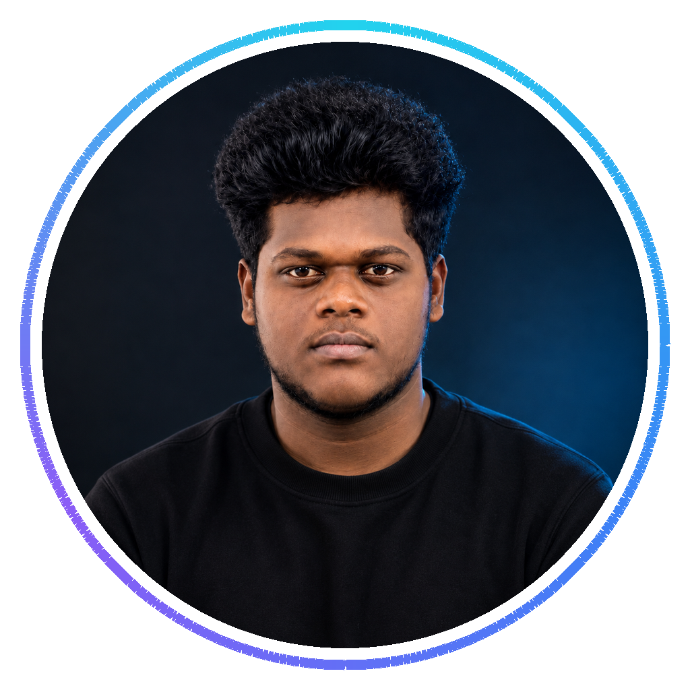

<a href="https://github.com/yuvaofficial15301-gif">GitHub</a>
&nbsp; ◆ &nbsp;
<a href="https://www.linkedin.com/in/yuva-raj-aa85b2426/">LinkedIn</a>

---

I'm **Yuvaraj**, a third-year **B.E. Artificial Intelligence and Data Science** student interested in developing practical AI-powered applications.

I explore how machine learning, intelligent systems, and software engineering can come together to solve useful problems.

- **Exploring:** Machine Learning, Generative AI, and LLMs
- **Interested in:** Computer Vision, Explainable AI, NLP, Robotics, and Edge AI
- **Building toward:** Practical AI applications and full-stack intelligent systems
- **Professional goal:** Growing into an AI engineer

<b>My engineering philosophy</b>

Understand the problem → learn the fundamentals → build a prototype → test the idea → improve the result.

---

<table>
<tr>
<td width="50%" valign="top">

**Intelligent Systems**

- Machine Learning
- Generative AI
- Large Language Models
- Explainable AI

</td>
<td width="50%" valign="top">

**Applied Engineering**

- Computer Vision
- Data Science
- Natural Language Processing
- Robotics and Edge AI
- Full-stack AI applications

</td>
</tr>
</table>

---

<table>
<tr>
<td width="50%" valign="top">

**Local-First Personal AI Assistant**

An assistant project exploring voice interaction, conversational AI, desktop automation, and online/offline model integration.

`Python` `FastAPI` `Ollama`

Explore project details

- Voice interaction
- Local model integration
- Desktop automation
- Offline-capable assistance

</td>
<td width="50%" valign="top">

**3D Printing Partner Marketplace**

A marketplace concept connecting customers with printing partners through model uploads, material selection, pricing, and order workflows.

`Next.js` `TypeScript` `Supabase`

Explore project details

- 3D model upload workflow
- Printer partner discovery
- Material-based pricing
- Order management

</td>
</tr>
<tr>
<td width="50%" valign="top">

**AI-Assisted Document Transformation**

A tool concept for transforming college documents into new templates while preserving formatting and supporting editable output.

`Next.js` `TypeScript` `FastAPI`

Explore project details

- Document and syllabus input
- Template-aware formatting
- Editable preview
- Document export

</td>
<td width="50%" valign="top">

**Antarctic Research Station Digital Twin**

A mission-control concept for research-station infrastructure, energy, logistics, environmental monitoring, and scenario simulation.

`Next.js` `TypeScript`

Explore project details

- Station monitoring dashboard
- Operational visualization
- Decision-support interface
- What-if simulation concept

</td>
</tr>
<tr>
<td width="50%" valign="top">

**Local Network Audio Sharing**

An app concept exploring group audio streaming over local Wi-Fi or a hotspot.

`Flutter` `Dart`

</td>
<td width="50%" valign="top">

**Gesture-Based Phone Control**

An Android concept exploring camera-based hand tracking to trigger custom phone actions.

`Android` `CameraX` `MediaPipe`

</td>
</tr>
</table>

These entries describe project concepts and development work discussed so far. They do not imply that every feature is complete or deployed. Add links when individual repositories are published.

---

  

Technologies are drawn from our project discussions. This is not a claim of expert-level proficiency in every tool.

---

I want to deepen my understanding of intelligent systems and learn how to turn AI models into useful, reliable software.

My focus is on developing strong fundamentals, experimenting with ideas, and improving through practical engineering work.

---

 

<a href="https://github.com/yuvaofficial15301-gif">GitHub</a>
&nbsp; · &nbsp;
<a href="https://www.linkedin.com/in/yuva-raj-aa85b2426/">LinkedIn</a>

  

AI & Data Science Student · Aspiring AI Engineer

